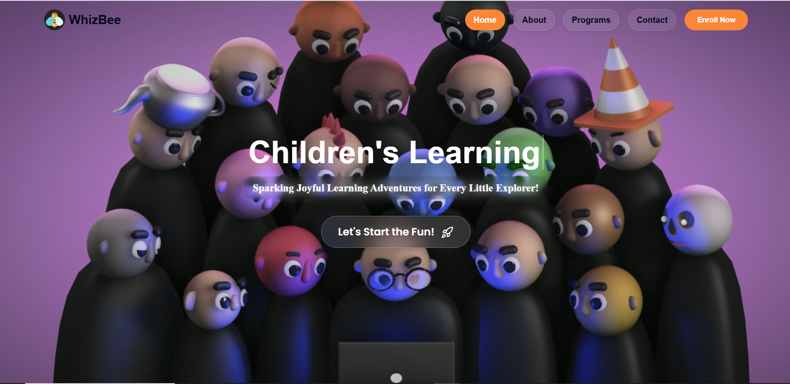
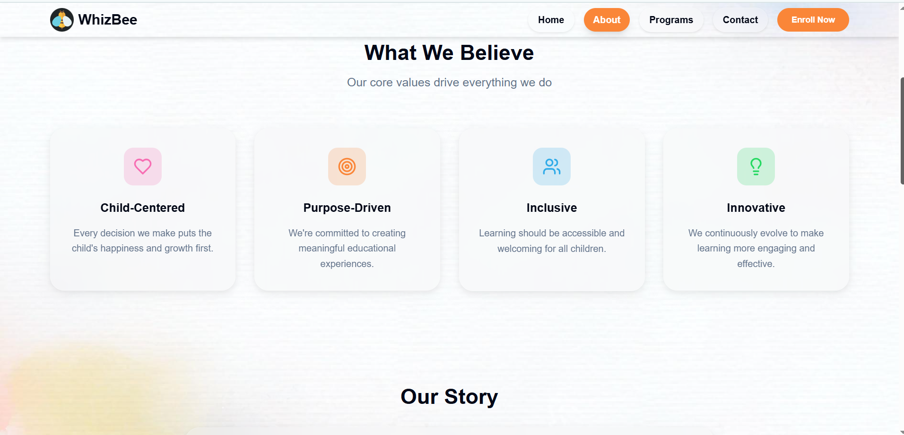
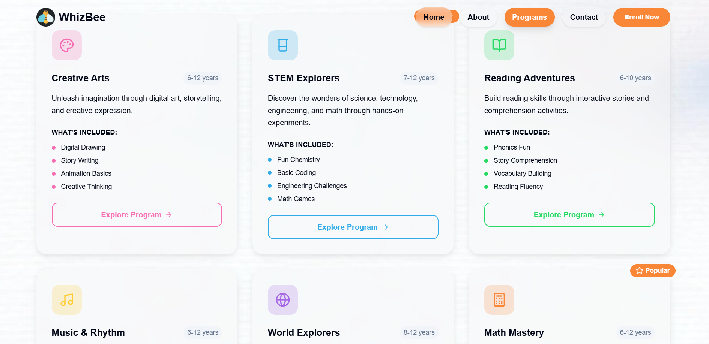
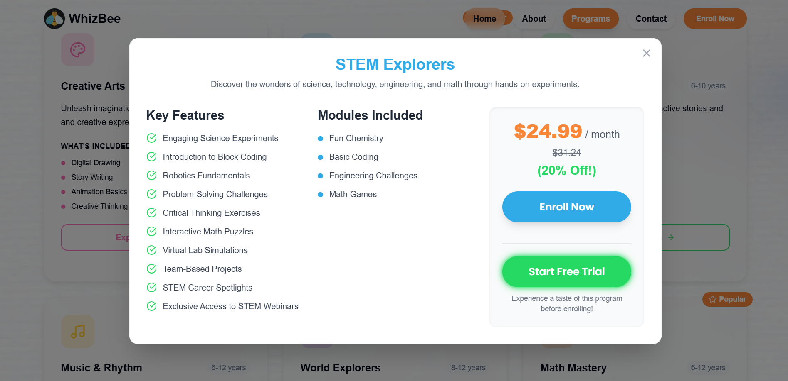
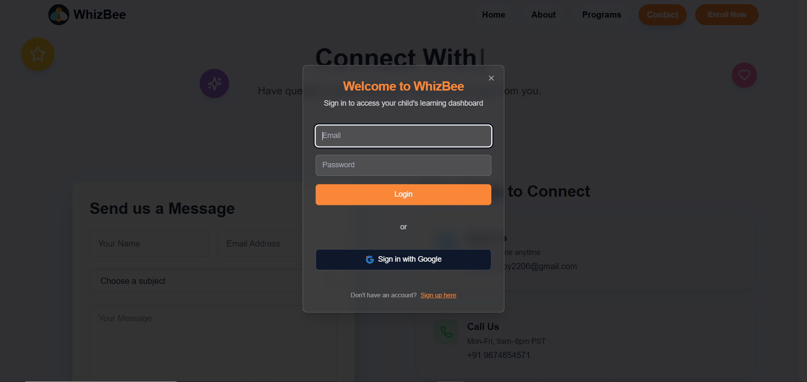
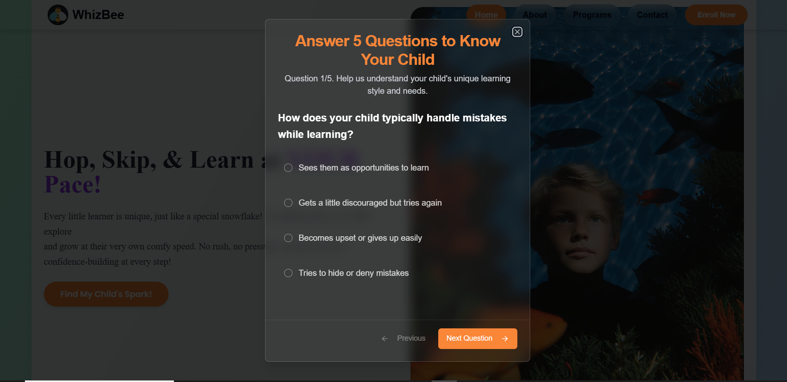
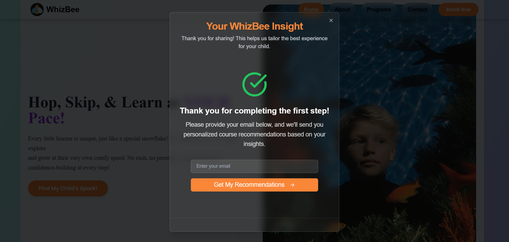
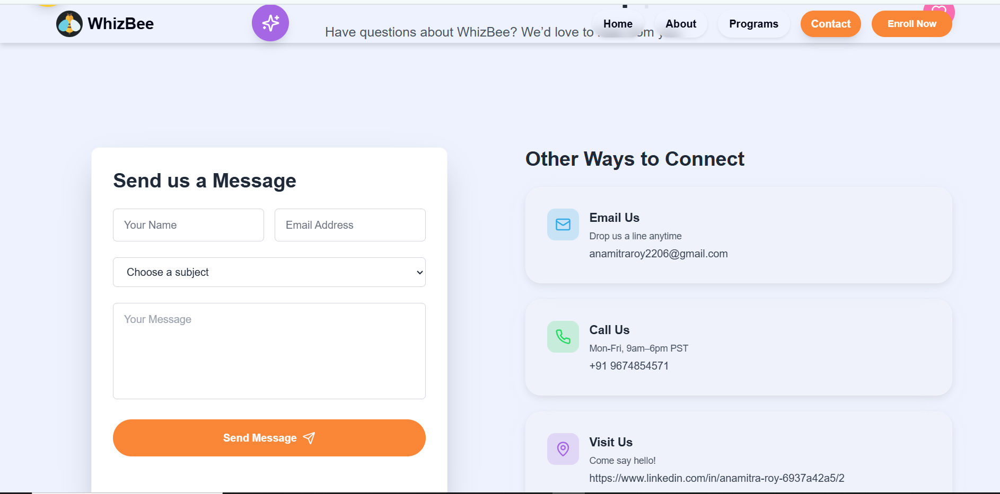

# 🐝 WhizBee

**WhizBee** is a playful and modern microlearning platform designed for children aged 6–12 and their parents.  
It empowers young learners with interactive modules, colorful 3D visuals, and fun psychometric-based personalization to make learning joyful, tailored, and effective.



---

## 🚀 Live Demo

👉 [[[Visit WhizBee on Netlify]([https://your-whizbee.netlify.app](https://whizzbee.netlify.app/)) ](https://whizzbee.netlify.app/)](https://whizzbee.netlify.app/)

---

## 🌈 Features at a Glance

- 🎨 Colorful, kid-friendly UI with glassmorphism and pastel themes  
- 🧠 Interactive microlearning modules: STEM, Creativity, Storytelling, and more  
- 📱 Fully responsive design (Mobile, Tablet, Desktop)  
- 🧩 3D assets and animations for immersive experience  
- 💬 Contact form powered by [Formspree](https://formspree.io/)  
- 🎁 Sample free trial backend using **Node.js**  
- 🔒 Future-ready authentication and user tracking  

---

## 🧭 About WhizBee

We believe children learn best when they explore, create, and play.  
The About page outlines our mission to spark curiosity and nurture growth.



---

## 📚 Programs Tailored for Every WhizKid

Explore curated microlearning programs designed around creativity, critical thinking, and fun.



From storytelling workshops to STEM challenges, WhizBee is packed with thematic modules that engage and educate.

---

## 🧠 Inside a Module

Every module contains interactive lessons, quizzes, and progress tracking — all wrapped in a child-friendly interface.



---

## 🔐 Login Experience

Children and parents can create accounts to save progress, access rewards, and personalize learning paths.



---

## 🧪 Smart Psychometric Onboarding

WhizBee begins with a delightful psychometric test to tailor each child’s journey based on their personality, strengths, and learning style.



---

## 🎉 Personalized Learning Path Unlocked!

Once the psychometric test is complete, learners receive customized course paths to maximize growth and joy.



---

## 📬 Contact Us

Have questions or feedback? Our playful contact page makes it easy for parents and educators to reach out.



---

## 🛠️ Built With

| Layer         | Tech                                      |
|---------------|-------------------------------------------|
| **Frontend**  | Next.js, Tailwind CSS, ShadCN, Framer Motion |
| **Backend**   | Node.js (for free trial prototype logic)  |
| **Contact**   | [Formspree](https://formspree.io/)        |
| **Design**    | Figma, Poppins/Nunito, Phosphor icons     |
| **3D Assets** | Spline / Blocky models                    |
| **Hosting**   | Netlify                                   |

---

## 📦 Getting Started

```bash
# Clone the repository
git clone https://github.com/Anamitraroy22/WhizBee.git

# Navigate into the project
cd WhizBee

# Install dependencies
npm install

# Start the development server
npm run dev
